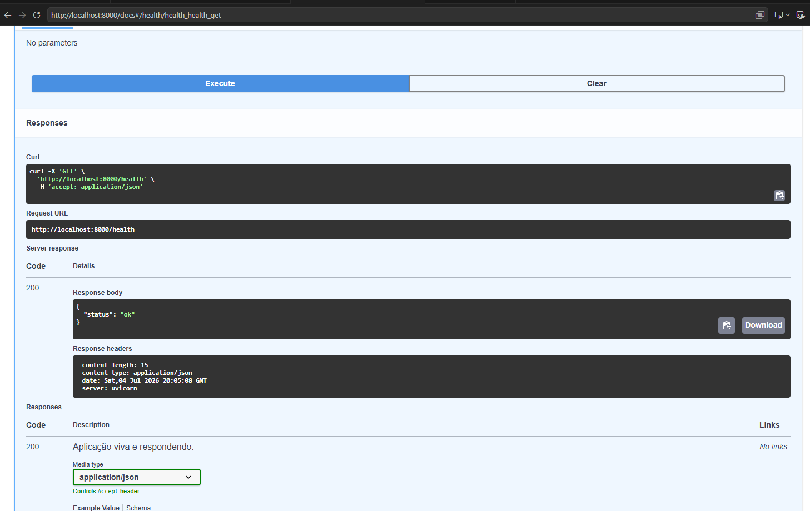
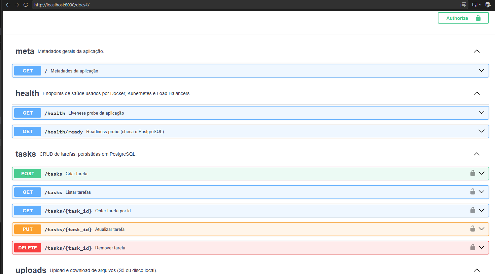

# Relatório final — CloudTask AI SaaS
---

## 1. Identificação

- **Aluno(a):** Gregory Antunes Hack
- **RU / matrícula:** 3699000
- **Disciplina:** Computação em Nuvem — UNINTER
- **Repositório:** https://github.com/gregory-hack/Computa-o-em-Nuvem---Projeto-exemplo-CloudTask-AI-SaaS.git
- **Data:** 04/07/2026

## 2. Resumo do projeto

O CloudTask AI SaaS é uma aplicação cloud-native moderna desenvolvida para o gerenciamento de tarefas (SaaS de produtividade), construída utilizando Python 3.11+ e FastAPI. O sistema permite o cadastro e acompanhamento de tarefas (com status e prioridades), upload de arquivos anexos, disparo de eventos assíncronos e verificação de saúde da infraestrutura.

## 3. O que foi implementado (por semana)

| Semana | O que foi implementado | Evidência (print / comando / endpoint) |
|--------|-------------------------|----------------------------------------|
| 1 — FastAPI + Docker | API REST funcionando com FASTapi (GET/, GET/health, CRUD inicial) containeirizada com Docker (Dockher file) e ambiente Dev Container | curl http://localhost:8000/health |
| 2 — PostgreSQL + config | Integração com PostgresSQL via Docker Compose, modelo TASK, configuração de variáveis (.env) com pydantic settings e preparação para HTTPS/TLS| curl http://localhost:8000/tasks |
| 3 — S3 + Kind |Upload de arquivos (POST/uploads) integrados ao S3 da Amazon com URL pré-assinada e fallback local, além do uso do KIND (Kubernetes)localmente para orquestração dos contêineres via manifests (infra/k8s/) | Validado por meio do endpoint POST /uploads, com confirmação do armazenamento do arquivo no Amazon S3. |
| 4 — ECR + EKS | Foi criado um repositório no Amazon ECR para armazenamento das imagens Docker da aplicação. A imagem foi construída localmente e enviada manualmente ao repositório utilizando Docker e AWS CLI, permitindo armazenar e versionar a aplicação em um registro de contêineres na AWS. Devido às limitações do ambiente AWS Academy, o deploy em Amazon EKS foi adaptado conforme orientação da disciplina, sendo mantido o foco na publicação da imagem no ECR. | aws ecr create-repository --repository-name cloudtask-api --region us-east-1 |
| 5 — HPA + DynamoDB | Foi implementado o registro de eventos da aplicação utilizando o Amazon DynamoDB como banco de dados NoSQL, com suporte a fallback local em JSON. Os eventos passaram a ser registrados automaticamente durante as operações do CRUD de tarefas, sendo validados por meio dos endpoints da API e da consulta à tabela no DynamoDB. Os conceitos de escalabilidade com HPA foram estudados durante a disciplina, porém sua implantação prática foi adaptada devido às limitações do ambiente AWS Academy. | Ver Comando abaixo |
| 6 — CDK + entrega | Foi implementada a infraestrutura como código utilizando AWS CDK em Python, automatizando o provisionamento de recursos como Amazon S3, Amazon ECR, Amazon DynamoDB, VPC, CloudWatch, Amazon RDS e a arquitetura final composta por três instâncias EC2 (Edge, API e Grafana). Também foram validadas a autenticação por JWT, o acesso seguro via HTTPS com certificado válido, o Swagger protegido por autenticação e o deploy completo da aplicação. Após os testes, toda a infraestrutura foi removida utilizando o processo de destroy, garantindo a liberação dos recursos criados. | ./semana-06-cdk-deploy.sh deploy  | e | cd infra/cdk && ./semana-06-cdk-deploy.sh destroy|

Comando de criação da tabela DynamoDB: Semana 5
aws dynamodb create-table --table-name cloudtask-events \  --attribute-definitions AttributeName=id,AttributeType=S \ --key-schema AttributeName=id,KeyType=HASH \
 --billing-mode PAY_PER_REQUEST --region us-east-1
aws dynamodb wait table-exists --table-name cloudtask-events

## 4. Arquitetura

                        Internet (HTTPS)
                                 │
                                 ▼
                     sslip.io (DNS dinâmico)
                                 │
                                 ▼
                  EC2 1 - Edge (Caddy + Frontend)
                  HTTPS + Proxy Reverso (/api /grafana)
                                 │
               ┌─────────────────┴─────────────────┐
               │                                   │
               ▼                                   ▼
      EC2 2 - API (FastAPI)              EC2 3 - Grafana
               │
        ┌──────┼────────────────────────────────────┐
        │      │                    │               │
        ▼      ▼                    ▼               ▼
 Amazon RDS   Amazon S3      Amazon DynamoDB   CloudWatch
(PostgreSQL) (Uploads)      (Eventos/Logs)   (Logs/Métricas)

Camadas da Arquitetura

Borda e Acesso (Edge):
O acesso à aplicação é realizado via HTTPS, utilizando uma instância Amazon EC2 com o servidor Caddy, responsável por servir o frontend, gerenciar o certificado TLS e encaminhar as requisições para a API (/api) e para o Grafana (/grafana) por meio de proxy reverso.

Computação:
A aplicação FastAPI foi executada em uma instância Amazon EC2 dedicada. O deploy foi realizado utilizando imagens Docker e infraestrutura provisionada com AWS CDK. A implantação originalmente prevista em Amazon EKS foi adaptada devido às limitações do ambiente AWS Academy.

Persistência Híbrida (SQL + NoSQL):

SQL (Amazon RDS PostgreSQL): utilizado para armazenar os dados relacionais da aplicação, como as tarefas cadastradas.
NoSQL (Amazon DynamoDB): utilizado para registrar eventos e logs de auditoria da aplicação, permitindo armazenar informações de forma escalável sem impactar o banco relacional.

Armazenamento de Objetos (Amazon S3):
Os arquivos enviados pela aplicação são armazenados no Amazon S3. Durante o desenvolvimento também foi utilizado o modo de armazenamento local (fallback), permitindo executar o projeto mesmo sem integração com a AWS.

Observabilidade:
O projeto utilizou CloudWatch para centralização de logs e métricas, além de uma instância dedicada do Grafana para visualização e monitoramento da aplicação.

Segurança e Controle de Acesso:
O acesso à API foi protegido por autenticação baseada em JWT (JSON Web Token). Toda a comunicação ocorreu por HTTPS, e o Swagger foi protegido por autenticação. O acesso aos serviços da AWS foi realizado utilizando as permissões disponibilizadas pelo ambiente AWS Academy e pela infraestrutura criada com o AWS CDK.

## 5. Como executar (reprodutível)
Pré - requisitos:
- Docker e Docker Desktop instalados
- Git instalado
- Vscode com extensão Dev Containers (recomendado)

PASSO A PASSO (Execução Localmente)
1  - Clonar o repositório da turma:
2 - Subir os contêineres
docker compose up -d --build
3 - Verificar API e Banco de dados, se estão rodando:
docker ps
- deve listar cloudtask-api (porta 8000) e cloudtask-db (porta 5432)

 - Testar a Saúde da API:
curl http://localhost:8000/health
 Resposta esperada: {"status":"ok"}

 - Acessar documentação (Swagger UI)
No navegador: http://localhost:8000/docs

 - Derrubar o Ambiente e limpar recursos
    docker compose down
    

  # 6. Decisões e trade-offs

Durante o desenvolvimento do projeto, buscou-se adotar uma arquitetura baseada em serviços da AWS, conciliando simplicidade, escalabilidade e os recursos disponíveis no ambiente AWS Academy.

Foi utilizada uma arquitetura composta por Amazon EC2, Amazon RDS, Amazon S3, Amazon DynamoDB, CloudWatch e AWS CDK, permitindo separar as responsabilidades da aplicação entre computação, armazenamento, banco de dados, observabilidade e infraestrutura como código.

Como banco de dados relacional, foi escolhido o Amazon RDS PostgreSQL, responsável pelo armazenamento das informações transacionais das tarefas. Para os eventos e registros de auditoria, optou-se pelo Amazon DynamoDB, mais adequado para dados NoSQL de alta disponibilidade e acesso rápido.

Os arquivos enviados pelos usuários foram armazenados no Amazon S3, utilizando também um mecanismo de fallback para armazenamento local durante o desenvolvimento, possibilitando a execução da aplicação mesmo sem dependência da AWS.

A infraestrutura foi descrita utilizando AWS CDK, permitindo automatizar a criação e a remoção dos recursos da nuvem de forma reproduzível e versionada.

Como principal adaptação do projeto, o deploy originalmente previsto para Amazon EKS não foi realizado devido às limitações do ambiente AWS Academy. Em seu lugar, a arquitetura final foi implantada utilizando três instâncias Amazon EC2, mantendo a separação entre o servidor de borda, a API FastAPI e o Grafana. Essa solução preservou os objetivos da disciplina relacionados à implantação, segurança e integração entre serviços da AWS.

Essa adaptação representou um trade-off entre a orquestração automática oferecida pelo Kubernetes e uma infraestrutura baseada em máquinas virtuais, porém permitiu validar todos os componentes essenciais da arquitetura proposta utilizando os recursos disponíveis no laboratório.

 ## 7. Custos

- **Recursos utilizados:** Amazon EC2 (3 instâncias), Amazon RDS PostgreSQL, Amazon S3, Amazon DynamoDB, Amazon ECR, CloudWatch e componentes da VPC.

- **Estimativa do período:** Os recursos permaneceram ativos apenas durante os testes e validações da aplicação. Considerando o tempo de utilização, o custo estimado seria de aproximadamente **US$ 0,10 a US$ 0,30**, caso fossem executados em uma conta AWS convencional. No ambiente AWS Academy não foi possível consultar os valores reais, pois os serviços **Cost Explorer** e **AWS Budgets** estavam indisponíveis.

- **Confirmação de limpeza:** Após a conclusão dos testes foi executado o comando ./semana-06-cdk-deploy.sh destroy, removendo as stacks criadas pelo AWS CDK. Também foi realizada a limpeza dos recursos remanescentes, incluindo o bucket Amazon S3, evitando custos adicionais.

## 8. LGPD e segurança

## Dados pessoais — mapeamento

- [X] Sei **quais** dados pessoais a aplicação coleta (no CloudTask: praticamente
      nenhum — tarefas são texto livre; cuidado se o usuário digitar dados
      pessoais no título/descrição).
- [X] Sei **onde** cada dado é armazenado (PostgreSQL/RDS, S3, DynamoDB).
- [ ] Sei **por quanto tempo** os dados ficam (retenção) e **como** são apagados.

## Bases legais e finalidade (LGPD art. 6–11)

- [X] A coleta tem **finalidade específica** e informada.
- [X] Há **base legal** (consentimento, execução de contrato, etc.) — em projeto
      didático, documentar a finalidade já cumpre o exercício.

## Segurança técnica (LGPD art. 46 — medidas de segurança)

- [X] **Em trânsito:** TLS/HTTPS na borda (ALB + ACM). Sem dado em HTTP aberto.
- [x] **Em repouso:** criptografia ativa — S3 (`S3_MANAGED`), RDS (encryption),
      DynamoDB (padrão). Confirme nos recursos criados.
- [x] **Segredos** não estão no código nem no git: .env e secret.yaml no
      .gitignore; em produção, Secrets Manager / SSM.
- [x] **Bucket S3 privado** (Block Public Access), acesso só por URL pré-assinada.
- [x] **Credenciais temporárias** (roles) em vez de chaves fixas no deploy.
- [ ] **Menor privilégio**: a app/role acessa só o que precisa.

## Direitos do titular (LGPD art. 18)

- [X] Existe caminho para **acessar** os dados de um titular (ex.: consultar/
      exportar suas tarefas).
- [X] Existe caminho para **excluir** (DELETE de tarefas + remoção de uploads).
- [X] Logs de eventos (DynamoDB) **não** guardam dado sensível desnecessário.

## Operação e incidentes

- [ ] **Backups** definidos (RDS tem snapshot automático; S3 versionado).
- [ ] Sei **como reagir** a um vazamento (revogar credencial, rotacionar segredo).
- [ ] **Cost/uso** monitorado (Budgets) — evita surpresa e uso indevido.

## Higiene de projeto

- [x] Nenhuma **conta AWS real** ou **segredo** commitado (revisar histórico).
- [x] Recursos de teste **destruídos** após cada aula (sem dado órfão na nuvem).
- [x] README e docs **não** expõem endpoints/credenciais internos.

---
## 9. Dificuldades e aprendizados

Durante o desenvolvimento do projeto, uma das principais dificuldades foi compreender como os diferentes serviços da AWS se relacionavam dentro da arquitetura da aplicação. No início, conceitos como Amazon ECR, Amazon EKS, Amazon S3, Amazon DynamoDB e AWS CDK pareciam independentes, mas, ao longo das práticas, tornou-se possível entender o papel de cada serviço e como eles se complementam em uma solução em nuvem.

Outro desafio importante foi a adaptação às limitações do ambiente AWS Academy. Algumas funcionalidades previstas originalmente, como a utilização do Amazon EKS e dos serviços de monitoramento de custos (AWS Budgets e Cost Explorer), não puderam ser executadas conforme o planejamento. Foi necessário compreender essas limitações e adaptar a solução para uma arquitetura baseada em instâncias Amazon EC2, mantendo os objetivos da disciplina.

Também foram enfrentadas dificuldades relacionadas à configuração do ambiente de desenvolvimento, autenticação, deploy da infraestrutura utilizando AWS CDK e limpeza dos recursos criados na AWS, especialmente durante a remoção da infraestrutura, quando foi necessário compreender o funcionamento do versionamento do Amazon S3 para excluir corretamente os objetos e permitir a destruição completa das stacks.

Como principal aprendizado, o projeto proporcionou uma visão prática sobre computação em nuvem, infraestrutura como código, conteinerização, integração entre serviços da AWS e boas práticas de arquitetura. Além do domínio técnico das ferramentas, foi possível compreender a importância do planejamento da infraestrutura, da automação de deploy e da documentação para garantir que uma aplicação possa ser implantada e mantida de forma organizada e reproduzível.

## 10. Anexos

- [X] lgpd-checklist.md preenchido
- [ ] deployment-checklist.md` (sweep de limpeza) preenchido
- [ ] Prints / logs das evidências da seção 3

11 - Prints/logs das evidências Semana a Semana.
Semana 1 - Endpoint GET Health funcionando 

Semana 2 - Inserção do CRUD de tarefas:

Semana - 3 KIND LOCAL - c:\Users\grego\Desktop\Prints Trabalho de Nuvem\Captura de tela 2026-07-04 142457.png
Semana - 4 ECR + EKS. Como não foi possível mais utlizar o EKS por limitação do Academy, fica somente a imagem no ECR:

Semana - 5 HPA + Dynamo DB. Não foi possível rodar o HPA por limitação da Academy, mas ainda assim foi posível criar a tabela no dynamo DB:

Semana - 6  CDK + ENTREGA FINAL: ./semana-06-cdk-deploy.sh deploy  
Saída./semana-06-cdk-deploy.sh destroy 

